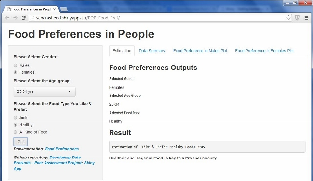

## Introduction

Healther and Hegenic Food is key to a Prosper Society.

Food Preferences in People (FPiP) is a basic application to calculate the estimation of Food people Prefered and/or Liked to take in their different ages.

There are 3 inputs that are required for estimation. On the provided data, FPiP will estimate the result. These inputs are:
 Gender, Age, and Food Type


FPiP application is consist of 4 parts.

1. Estimation - Computes the Estimate on the provided data.
2. Data Summary - Data representation
3. Food Preferences in Males Plot - Food Comparison Chart
4. Food Preferences in Females Plot - Food Comparison Chart

--- .class #id 

##  Shiny App: Food Preferences in People (FPiP)

<div style='text-align: center;'>
    
</div>   
[Food Preferences in People App Hosted by shinyapps.io](http://sanarasheed.shinyapps.io/DDP_Food_Pref/)

---

## Food Preferences in Males Plot

```{r, echo=FALSE, results='asis', message=FALSE}
require(rCharts)

data <- read.csv('assets/food.csv')

h1 <- hPlot(Estimate~Food_Type, data = subset(data, Gender=="Males"), type = c("line", "bubble"), group = "Age", size="Estimate")

h1$save('assets/img/m1.html',cdn=TRUE)
cat('<iframe src="assets/img/m1.html", width=100%, height=600></iframe>')

```


---

## Food Preferences in Females Plot 

```{r, echo=FALSE, results='asis', message=FALSE}
require(rCharts)
data <- read.csv('assets/food.csv')

h1 <- hPlot(Estimate~Food_Type, data = subset(data, Gender=="Females"), type = c("line", "bubble"), group = "Age", size="Estimate")
                        
h1$save('assets/img/f1.html',cdn=TRUE)
cat('<iframe src="assets/img/f1.html", width=100%, height=600></iframe>')                        

```

